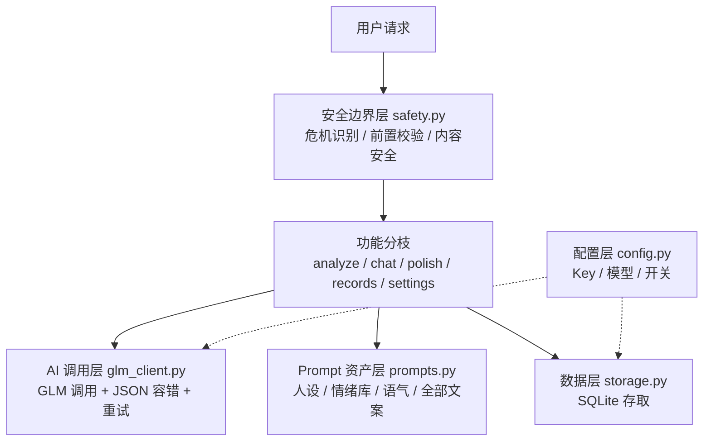

# meimei 情绪分析小程序 方案 v40（定稿版·已敲定）

（v40：登记「小程序合规显示」待办为定时提醒——用户点名：没做进小程序的合规项，到二期 UI / 上架前必须主动提醒，未做完不算上架。
  v39：新增「当前进度」小节。
  v38：节点 2 施工完成；勘误第 4 条（对话 JSON 模式）。
  v37：AI 自称统一为"我"，文档与代码同步；行为验证通过。
v36：节点 1 施工完成；勘误记录三条——均为验证环节当场抓获）

（v30：澄清商用授权书与 API 付费路径的区别——授权书针对模型下载自部署，
我们走 API 路径"付费即合规"，个人可付费，无需授权书；
新增上架前提醒事项：切换付费模型）

**总设计图见仓库根目录 BLUEPRINT.md**，施工时以它为准逐节点执行。

## 当前进度（每次更新，新对话从这里接续）

最后更新：2026-09-21

**状态：一期 MVP 六个节点代码全部完成，已合并到 main 分支。**

- 节点 0~6 全部施工完毕：主干骨架 → 分析 → 反思对话 → 润色 → 记录与设置 → 小程序骨架 → 合规文件
- PR 状态：#6 已合并；#7~#12 的内容已通过线性合并全部进入 main 并关闭（无代码遗漏）
- 环境：GLM API Key 已配置且验证有效（在 .env，不入库）；依赖已安装
- 真实 GLM 实测通过：分析/对话/润色质量良好；响应约 9 秒；免费版偶发限流 429（SDK 自动重试兜底）
- 已补充：反馈查看接口 GET /api/feedback；联系邮箱已写入合规文件与 README
- v40：小程序里**还没显示**的合规项已写入下方「十二、用户手动事项」——二期 UI / 上架前必须提醒，未做完不算上架（用户点名）

**待用户完成**：
1. 小程序联调（代码拉到本地 → 启动后端 → 微信开发者工具导入 miniprogram/ → 填 AppID → 勾选不校验合法域名 → 跑通全流程）
2. 3~5 人真实试用并收集反馈（二期 UI 讨论的输入）

**下一步**：等用户联调结果 → 二期启动（UI 设计讨论、雷达图可视化 ECharts、微信登录/账户绑定）。二期一开始先提醒「小程序合规显示待办」。

**新对话接续方式**：规则文件 .cursor/rules/meimei.mdc 自动加载 → 读本文件（决策清单 + 本节）→ 读 BLUEPRINT.md → 从"下一步"继续。

历经九轮问答 + 四轮心理专家评审（17 条）+ 三轮产品经理评审（14 条）+ 两轮律师评审（12 条）+ 一轮普通用户评审（5 条）定稿，全部采纳。本文件是施工蓝图：任何改动先改方案，再动工。

## 〇、协作铁律

- 只有用户明确下命令，才能写代码 / 运行程序
- 每轮问答后输出更新后的完整方案
- 方案每次更新都同步 push 到 GitHub，一版一个 commit（v10 起已执行）
- 产品最终完成前，必须以四个视角（心理专家 / 产品经理 / 律师 / 普通用户）再完整复审一遍，经用户确认后才算完成
- 全局规则已固化为 `.cursor/rules/meimei.mdc`（每次新对话自动加载）：计划先行、编码规范、架构约束、自运行元规则、勘误机制，详见该文件

## 一、产品定位

私密的对话记录情绪分析工具。不预设用户处境：气话、好话、日常对话都能分析。
面向所有想厘清情绪、反思表达的人，不局限特定群体。
分析为主、对话为辅；默认温柔人设；开源也没事（用户明确）。

### 用户为什么不直接和通用 AI 对话，而选择本产品（路演答辩必答题）

1. 结构化结果 vs 自由文本：雷达图、占比、强度、关键句——通用聊天给不了"看得见的情绪"
2. 流程化封装：用户不用会想怎么提问（prompt），粘贴即得稳定质量的"分析→解读→安慰→引导→润色"全流程
3. 情绪档案：结构化记录、可筛选、可回看、可删除——通用 AI 的聊天记录散落无法管理
4. 温柔人设一致性：精心设计并固化，每次体验一致；通用 AI 每次都要自己调
5. 隐私：本地存储、不联网统计——"连你用了几次都不知道"；通用 AI 平台数据在厂商服务器
6. 场景化安全设计：危机干预、反刍检测、依赖提醒——通用 AI 不会为这个场景专门设计

## 二、最终决策清单（八轮问答全部结论）

1. 分析对象：双向——既分析"我"，也推测"对方"的言外之意（带"基于文字推测"免责标注）
2. 内容方向：不预设吵架/不顺，任何内容都可分析，prompt 中性开放
3. 输入：双输入框（用户提出：同一句话在不同场景下情绪不同）——内容框（自由粘贴文本，仅文本，不做 OCR，单次上限 5000 字，AI 自动分辨说话人）+ 背景框（可选自由填写"这是在什么情况下发生的"，无预设列表）
4. 分析粒度：整段总分析 + 点出最关键 2~3 句原话
5. 分析输出：动态情绪雷达图 + 我的解读 + 对方心理推测 + 回应语 + 引导式提问 + 复盘建议（好话时变为"延续建议"）
6. 情绪体系：大情绪库（约 50 个）+ AI 动态选占比最高 6~8 个；占比（总和 100%，雷达图）+ 强度（0-100，详情）两个都给
7. 反思对话：详见第五节
8. 润色：独立入口；基于非暴力沟通框架（观察→感受→需要→请求）；直接润色默认 3 个温柔系版本；有分析上下文时自动组合语气；可手动指定、多轮微调；基调一定是温柔，不设攻击性语气
9. 记录：全部自动保存；全部情绪库词都可作为筛选条件（界面形态二期 UI 讨论定）；支持删除
10. 趋势图：不做
11. 跨记录记忆：前期不做，全部功能完成后考虑（见未来候选）
12. 账号：MVP 单机单用户；二期微信登录绑定；最终上架小程序
13. 称呼系统【MVP 最简版】：首次打开填"希望 AI 怎么称呼你"；AI 不使用名字，自称一律为"我"（用户明确，v37 起），后续慢慢完善
14. 模型：只用智谱 GLM；分析/对话/润色全部用免费的 glm-4.7-flash，配置文件可改
15. 部署：MVP 本地运行
16. 仓库：开源也没事（用户明确），无需设 private
17. 密码保护：MVP 不加；本地存储 + .gitignore 排除保护
18. 失败提示：温柔文案 + 重试，用用户设定的称呼
19. 充值：三期功能，届时提醒用户设置
20. 命名：后面再定
21. 智能体形态：同一个温柔人设；内部分模式，共享人设 prompt
22. MVP 验收标准：本地跑通 分析 + 反思对话 + 润色 + 记录筛选 + 小程序骨架联调；之后找 3~5 个真实用户试用并收集反馈（二期 UI 讨论的输入）
23. 长对话成本控制：超过约 20 轮自动把早期对话压缩为摘要，用户无感知
24. 危机干预【MVP 必须】：检测到自伤/自杀信号时中断常规分析，温柔提供专业求助渠道
25. 对方心理推测：以开放的多种可能性呈现，结尾引导用户直接沟通验证
26. 反刍检测：不主动收尾，但发现用户原地打转时温柔指出并建议休息
27. 占比文案：说明是"这段话检测到的情绪中的相对比例"、基于文字的估计
28. 润色基于非暴力沟通框架（观察→感受→需要→请求）
29. 复盘建议措辞一律面向未来（"下次可以试试"），禁止"你当时应该"
30. 依赖边界：深度对话后合适时机温柔提醒"真正的和解要回到现实关系里"
31. 异议处理【用户修正】：用户质疑分析后，AI 与用户平等讨论，再由 AI 就事论事判断是否改分；AI 不诡辩、不迎合；用户的异议内容存入记录
32. 情绪标签边界声明：文案强调"这些情绪是那一刻的状态，不是对你这个人的定义"
33. 好话场景的对方推测：以肯定为主、克制解读，不强行列出"另一种可能"
34. 严重关系伤害（家暴/霸凌/PUA 等权力不对等）：建议方向从"改善沟通"转向"保护自己、寻求支持"，与危机干预互补
35. 先降温后反思：情绪激烈（痛苦/攻击性分数高）时，分析结果先以安抚为主，引导提问与复盘建议延后到对话中情绪缓和时再带出
36. 改分留痕：AI 讨论后改分时保留原始分数与修改轨迹，不覆盖——演变过程本身是反思素材
37. 危机干预后持续陪伴：给出求助渠道后 AI 继续温柔陪伴（不做常规分析），直到用户状态平稳，杜绝"转介完就消失"
38. 回看负面记录时，记录详情页开头温柔承接（"那时候你很难受吧"），不冷冰冰直接展示数据
39. 第三方隐私提示："你粘贴的内容可能包含他人的话；分析结果仅供自我反思，请勿用于评判或攻击他人"
40. 无诊断声明："本工具不做任何心理诊断，分数只反映这段话的文字情绪"
41. 新手引导：首页"试试示例"入口，内置示例一键跑通完整流程，新用户 30 秒看到产品价值
42. 首页主次入口：主按钮"开始分析"；"直接润色"降级为次要入口，主干清晰不迷路
43. 回访动机：记录页温和陪伴文案（"这是你第 N 次认真面对自己的情绪"），绝不做打卡/连续天数的游戏化压力
44. 反馈入口：设置页极简反馈框，提交存后端
45. 参赛演示动线（开发优先级以此为准）：粘贴真实记录 → 雷达图 → 温柔解读 → 追问"为什么" → AI 引用原话解释 → 润色出"温柔但坚定"版本
46. 范围备胎：如需加快，"记录筛选"和"称呼系统"可降级到二期
47. 隐私政策：MVP 简版（数据只存设备、不出设备、可删除）；二期上架前完整合规（告知-同意、删除权）
48. 完整免责声明："AI 分析与润色仅供参考，不构成心理、医疗或法律建议；用户基于分析结果的行为责任自负"
49. 危机干预文案：表述为"提供信息"而非"承诺救助"；热线号码实现时逐条核实真实有效
50. 违法内容处置：上架时配合 msgSecCheck 建立"检测→处置"流程
51. AI 生成内容著作权归用户（用户协议明确）
52. 开源协议：仓库加 MIT LICENSE；API Key 已被 .gitignore 排除
53. AI 生成内容显式标识（《人工智能生成合成内容标识办法》2025-09-01 施行）：结果页标注"本内容由 AI 生成"，MVP 即加
54. 生成式 AI 监管路径（《生成式人工智能服务管理暂行办法》《互联网信息服务深度合成管理规定》）：接入已备案的 GLM 模型，上架时小程序后台如实声明，保留 API 合规凭证
55. 免责声明显著提示（《民法典》第 496-497 条格式条款规则）：首次使用时弹窗单独确认，同意留痕，不埋在长文本里
56. 未成年人保护（《未成年人保护法》网络保护专章、《未成年人网络保护条例》）：上架时年龄提示 + 青少年模式适配；危机干预对未成年用户尤其不能缺位
57. GLM 服务条款核查【已完成，结论如下】：
    - 免费功能仅限"非商业的个人研究学习"（用户协议）→ 开发测试阶段合规
    - 付费功能按平台规则付费后可商业使用（服务协议 3.4）→ **上架前必须切换付费模型**（config 改一行，架构已支持）
    - 模型商用授权书仅企业用户可申请，但**授权书针对的是"下载模型自部署"场景**；
      我们走 API 路径——按平台规则付费即获商用许可，个人也可付费，无需授权书
    - 个体工商户要解决的是微信侧支付主体问题（个人主体小程序不能接虚拟支付），与智谱侧无关
    - 向第三方提供服务的责任由开发者自担；须建立内容审核与处置机制（我们的 msgSecCheck + 处置流程已对齐）
    - 未按要求标识 AI 生成内容导致处罚的，责任由开发者承担 → "本内容由 AI 生成"标识必须到位（决策 53）
    - 不得宣称产品被智谱认可或支持
58. 参赛规则核查：确认比赛允许开源
59. 等待体验：分析等待时显示渐进式温柔文案（"我正在认真读你的话……"→"正在体会背后的情绪……"→"快好了……"）
60. 脱敏分享卡片：二期考虑（只有雷达图 + 一句金句，不含原文和他人信息），MVP 不做
61. 差异化定位语（参赛路演开场白）：把"分析情绪 + 润色表达 + 陪你反思"做成闭环的私密工具
62. 不做任何联网统计："我们连你用了几次都不知道"——隐私承诺，也是卖点
63. 空状态引导：记录页为空时温柔引导开始第一次分析
64. 结果页信息层级"先情后理"：第一眼安慰回应，然后雷达图，再解读和建议（二期 UI 总原则）
65. 引导提问即对话入口：点击任一引导问题直接进入对话，问题自动带入——提问和对话是一条路
66. 反思完成感：保存记录时温柔确认（"这次反思已经收进你的档案了。愿意面对自己的情绪，这本身就不容易"）
67. 首页文案降低输入摩擦："不一定非要聊天记录，此刻心里堵着的那句话也可以"
68. 数字配人话：强度分四级文案（轻微 0-30 / 明显 30-60 / 强烈 60-85 / 非常强烈 85+），用户看到"委屈：强烈"，数字当配角
69. "这里没有评判，只有理解"：首次使用和分析结果页的产品语言承诺
70. 开场白模板：首页提供开口模板（"我和 ta 吵架了……""我也不知道我为什么难过……"等），并提示可用输入法语音输入
71. 应用锁：二期候选（手势/指纹），防手机被他人看到记录
72. 首页明确"完全免费"（MVP 阶段），消除戒备
73. 最终复审检查点：产品最终完成前，以心理/产品/律师/用户四视角再审一遍，用户确认后才算完成
74. 双输入框的名称：叫"背景"（口语化，普通用户一看就懂）；背景框 placeholder 引导语："（可选）这是在什么情况下发生的？说了背景，我会分析得更准"
75. 润色入口同样提供可选背景框（对老板和对伴侣说的话，润色方向不同）
76. 背景随记录保存，回看时提供"当时是什么情况"的上下文
77. 背景框给可模仿的示例："比如：和男朋友冷战第三天 / 季度考核前一周"
78. 内容框 placeholder 明确："把聊天记录或你想说的话放这里"，与背景框文案形成对比，用户一眼分清
79. 背景框减压文案："不填也没关系，我会自己试着理解"——温柔产品不给用户愧疚感
80. 工作原则【用户明确】：前后端不糅杂——UI 相关事项只作提醒，二期集中讨论处理
81. 结果波动提示：结果页固定提示"每次分析是那一刻的理解，同一内容多次分析分数可能略有波动"
82. 危机识别免责写到位：文案明确"危机识别为关键词 + AI 双保险，但无法承诺零漏判"，与求助引导一起呈现
83. 创新点 A「情绪猜想对比」进 MVP：粘贴后用户先猜自己的情绪构成，再揭示 AI 分析——"你以为你很愤怒，原来你更多是委屈"的自我认知对照（直接对话做不到的差异化）
84. 创新点 B「对话彩排」（AI 扮演对方，用户练习说润色后的话）、C「暂停键」（吵架当下秒回杀伤力等级与建议）入未来候选
85. 开源即信任【写进声明，让用户看见】："本工具代码全部开源，数据不出你的设备，谁都可以查"——可验证的隐私承诺
86. 温柔人设防崩塌：示例库（few-shot，5~10 个精心编写的回应示例）+ 温柔回归测试集（20 个典型场景标准回应，改 prompt 后必跑）进 MVP；回应前自检与用户打分施工时按复杂度再定
87. 声明与实现严格一致：声明文案随实现更新，实现变了声明先改（防虚假宣传）；二期数据上传后"不出设备"声明必须同步修改
88. 示例库与测试集内容必须原创虚构，不使用任何真实聊天记录（开源后等于公开）
89. 猜想环节极轻化：只选"你觉得最主要的情绪是哪一个" + 强度滑块（轻微/明显/强烈/非常强烈，与结果页用词一致），一键完成，不做百分比分配
90. 猜想可跳过："跳过，直接分析"按钮必须显眼
91. 范围管理：节点 1 过大时，"猜想对比"允许降级到节点 6 之后补；温柔测试集的标准回应需用户验收"对味"
92. 猜错包装文案："猜错才有意思：猜错的地方，就是你没发现的自己"

## 三、情绪体系（三层保障：任何表达都有对应情绪）

### 第一层：情绪库按"家族 + 强度梯度"组织（系统性覆盖）

8 个基本情绪家族（Plutchik），每个家族带强度梯度词：

- 愤怒：不爽 < 恼火 < 生气 < 愤怒 < 暴怒
- 悲伤：失落 < 难过 < 悲伤 < 悲痛 < 绝望
- 恐惧：不安 < 担心 < 焦虑 < 恐惧 < 惊恐
- 喜悦：满足 < 开心 < 喜悦 < 狂喜
- 信任：接受 < 信任 < 亲近 < 崇拜
- 厌恶：无聊 < 嫌弃 < 厌恶 < 憎恶
- 惊讶：意外 < 惊讶 < 震惊
- 期待：留意 < 期待 < 盼望 < 渴望

外加：复合情绪（委屈/爱/羞耻/内疚/失望/嫉妒/轻蔑/乐观/悔恨等）、
社会情绪（孤独/尴尬/自豪/感动/宽慰等）、中文高频词（无奈/心酸/踏实/温暖/释然/怀念/心动/心安/疲惫/憋屈等）。
库存于 prompts 配置，可随时扩充。

### 第二层：AI 兜底

AI 优先从库内选词；库内没有贴切词时允许自创情绪词并标注"库外"，分析不中断。

### 第三层：库自增长

库外词记录到日志，定期把高频词补进库，库越用越全。

### 分析产出

AI 选出占比最高 6~8 个：占比（总和 100%，画雷达图）+ 强度（0-100，详情）+ 一句话解释。
每次雷达图的轴由内容决定。

呈现原则（心理专业要求）：
- 数字配人话：强度分四级（轻微/明显/强烈/非常强烈），数字只当配角
- 占比文案必须说明：这是"这段话检测到的情绪中的相对比例"，是基于文字的估计，避免伪精确
- 情绪标签边界声明："这些情绪是那一刻的状态，不是对你这个人的定义"
- 无诊断声明："本工具不做任何心理诊断，分数只反映这段话的文字情绪"
- 第三方隐私提示："你粘贴的内容可能包含他人的话；分析结果仅供自我反思，请勿用于评判或攻击他人"
- 对方心理推测以开放的多种可能性呈现（"可能是……也可能是……"），
  结尾引导用户："与其猜，不如找个时机直接问问对方"；
  好话场景下以肯定为主、克制解读，不强行列出"另一种可能"
- 复盘建议一律面向未来（"下次可以试试……"），禁止"你当时应该……"的事后诸葛句式；
  识别到严重关系伤害（家暴/霸凌/PUA 等权力不对等）时，建议方向从"改善沟通"
  转向"保护自己、寻求支持"

## 四、边界处理（四层防线，全程温柔）

0. 危机干预（最高优先级，先于一切分析）：检测到自伤/自杀信号 → 中断常规分析，
   温柔但明确地提供专业求助渠道（心理援助热线等，实现时核实最新号码），并表达陪伴；
   之后 AI 继续温柔陪伴（不做常规分析打分），直到用户状态平稳，杜绝"转介完就消失"
1. 前置校验（代码层，不花 AI 费用）：空内容、超 5000 字、纯符号乱码 → 温柔提示重新输入
2. AI 判断（prompt 层）：内容读不通、不像人话 → 温柔回应并引导，不出分析结果
3. 内容安全（合规层）：辱骂/违法/敏感内容 → 温柔拒绝 + 引导；上线前接入微信 msgSecCheck；GLM 自带安全机制

## 五、反思对话（已定案）

分析后用户可与 AI 对话，两种发起方式：AI 主动给 2~3 个引导提问；用户主动追问/质疑分析。

AI 回应原则：
- 解释温柔、有理有据：引用原话说明分析依据
- 先接纳感受，再说理
- 可引导用户心理，对用户在对话中表达的想法进一步分析
- 顺着用户的话往下说，不生硬

边界规则：
- 用户质疑分析结果时，AI 与用户**平等讨论**：温柔解释依据、就事论事，不诡辩、不迎合；
  讨论后由 AI 判断是否改分；改分保留原始分数与修改轨迹，不覆盖；
  用户的异议内容存入记录（用户的自我认知同样珍贵）
- 先降温后反思：情绪激烈时先以安抚为主，引导提问与复盘建议延后到情绪缓和时再带出
- 不主动收尾：用户不走，对话就一直继续
- 反刍检测：发现用户原地打转（反复咀嚼同一痛苦）时，温柔指出并建议行动或休息——这不是收尾，是专业关怀
- 依赖边界：深度对话后的合适时机，温柔提醒"我能陪你理清思路，但真正的和解要回到你们之间"，不说教
- 上下文：携带原文 + 完整分析结果 + 对话历史；超 20 轮自动压缩早期对话为摘要
- 对话内容自动存入该条记录

## 六、MVP 页面结构（小程序最小骨架，UI 设计二期再讨论）

0. 首次使用：免责声明 + 隐私政策弹窗，单独确认后进入（格式条款显著提示，同意留痕）
1. 首页：内容输入框 + 背景输入框（可选）+ "开始分析"主入口 + "直接润色"次要入口
   + "试试示例"新手引导；开场白模板帮用户开口（可语音输入）；"完全免费"标识；
   "这里没有评判，只有理解"；分析等待时显示渐进式温柔文案
2. 分析结果页：信息层级先情后理（安慰回应 → 雷达图 → 解读建议）；
   引导提问可点击直接进入对话（问题自动带入）；保存记录时温柔确认
3. 记录列表页：情绪筛选 + 删除 + 温和陪伴文案（"第 N 次认真面对自己的情绪"）；
   空状态时温柔引导开始第一次分析
4. 记录详情页：完整分析 + 对话历史 + 继续对话；回看负面记录时开头温柔承接
5. 设置页：称呼设置 + 反馈入口

提醒事项（不进入本期施工，二期 UI 讨论时处理）：
- 首页信息层级：内容框是绝对主角，背景框默认折叠为一行小字"补充背景（可选）"，点击展开
- 背景框的设计依据：书写表达本身有疗愈价值（expressive writing），它服务的不只是 AI，还有用户自己

## 七、技术架构与施工架构篇（主干-分枝）

技术选型：Python + FastAPI 本地运行（自带 /docs 测试页）；智谱 GLM（zai-sdk，glm-4.7-flash 免费模型）；
SQLite（数据库文件与 .env 均被 .gitignore 排除）；演示模式未配置 Key 时返回内置示例；
前端微信小程序最小骨架（二期做 UI）。

### 主干五层（稳定不动，职责单一）

1. `config.py` 配置层：API Key、模型名、演示开关
2. `glm_client.py` AI 调用层：唯一的 GLM 出入口，JSON 容错 + 重试
3. `prompts.py` Prompt 资产层：人设、情绪库、语气、全部文案（调语气只动这里）
4. `safety.py` 安全边界层：四层防线（危机 → 校验 → 读不懂 → 内容安全）
5. `storage.py` 数据层：SQLite 存取

### 分枝六模块（各自独立文件，互不纠缠）

`analyze.py` 分析 / `chat.py` 反思对话 / `polish.py` 润色 / `records.py` 记录 /
`settings.py` 称呼与反馈 / 小程序前端（二期 UI）

### 决策归属（80 条决策各有其家）

- 配置层：14, 15, 25, 演示模式
- Prompt 资产层：6, 7, 21, 28, 68, 69, 70, 72, 77, 78, 79 及全部文案
- 安全边界层：19, 26, 37, 48, 50, 55
- 分析分枝：1, 3, 4, 27, 29, 32, 33, 34, 39, 40, 64, 74
- 对话分枝：9, 28, 30, 31, 35, 36, 65
- 润色分枝：8, 10, 28(NVC)
- 记录分枝：11, 12, 38, 43, 63, 66, 76
- 设置分枝：14, 44
- 二期前端：页面结构 + 提醒事项
- 合规文件：47-58（隐私政策 / 免责声明 / 用户协议 / LICENSE）
- 未来候选：跨记录记忆、脱敏分享卡片、应用锁

### 实施顺序（主干 → 分枝 → 叶子）

1. 主干五层骨架 → 2. 分析分枝 → 3. 对话分枝 → 4. 润色分枝 →
5. 记录/设置分枝 → 6. 小程序骨架 → 7. 叶子：示例数据与文案微调

### 节点施工表（每个主干节点分出哪些树枝；每节点完成后自动 push 并提醒用户）

**节点 0：主干骨架**
- 五层主干文件：config.py（配置）/ glm_client.py（AI 调用）/ prompts.py（人设+情绪库+全部文案）/ safety.py（四层防线）/ storage.py（数据）
- 配套：requirements.txt、.env.example、.gitignore、README
- 健康检查接口，服务能跑起来

**节点 1：分析分枝 /api/analyze**
- 双输入框参数（内容 + 可选背景）
- 动态情绪库：选占比 top 6~8；占比 + 强度 + 四级人话
- 双向解读、对方推测（开放可能性 + 免责标注）、关键句点出
- 安慰语、引导提问、复盘建议（好话时变延续建议）
- 接入危机识别（safety 第零层）；分析完自动存记录

**节点 2：反思对话分枝 /api/chat**
- 携带完整上下文（原文 + 分析结果 + 对话历史）
- 平等讨论改分 + 改分留痕；先降温后反思；反刍检测；依赖提醒
- 超 20 轮自动压缩；对话存入记录

**节点 3：润色分枝 /api/polish**
- 非暴力沟通框架；AI 自动组合 2~3 种语气
- 预设语气 + 自然语言语气 + 多轮微调
- 独立入口（可带背景框）；结果合并进记录

**节点 4：记录 + 设置分枝 /api/records、/api/settings**
- 记录列表（情绪筛选）、详情、删除
- 称呼设置、反馈入口

**节点 5：小程序骨架**
- 5 个页面最小实现，打通全部 API（UI 美化二期讨论）

**节点 6：叶子**
- 示例数据（"试试示例"）、文案微调
- 合规三件套（隐私政策 / 免责声明 / 用户协议）、MIT LICENSE

### 分叉点规则（防代码过乱）

- 改语气/文案/人设/情绪词 → 只动 prompts.py
- 改边界规则 → 只动 safety.py
- 加新功能 → 新建文件 + main.py 注册一行，不碰其他模块
- UI 相关 → 不进后端，记入提醒事项，二期集中讨论

## 八、分期路线图

- 一期 MVP：动态情绪分析 + 反思对话 + 润色 + 记录（筛选/删除）+ 称呼系统最简版 + 小程序骨架（5 页）
- 二期：小程序 UI 设计（与用户讨论）、雷达图可视化（ECharts）、微信登录/账户绑定
- 三期：开放式 Agent 陪聊、充值（届时提醒用户设置）

## 九、未来候选（全部功能完成后再考虑）

- 跨记录记忆：AI 记得用户历史记录，提供更懂你的陪伴
- 脱敏分享卡片：只有雷达图 + 一句金句，不含原文和他人信息（二期可考虑）
- 应用锁：手势/指纹解锁，防手机被他人看到记录（二期候选）
- 双 AI 一致性分析：两个独立分析交叉验证提高准确性（注意同源偏差——真正的交叉验证需引入第二家模型，届时重新讨论"只用 GLM"的决策；MVP 阶段可用"单次分析 + AI 自检"轻量替代）
- 对话彩排：AI 扮演对方，用户在安全环境练习说润色后的话（把"我当时要是……就好了"变成彩排）
- 暂停键：吵架当下丢进一句话，秒回杀伤力等级与建议
- 其他用户届时提出的想法

## 十、风险与建议

技术可行性结论（已评估）：MVP 全部功能无硬性技术障碍。需注意：
- GLM 输出 JSON 的稳定性 → 代码层归一化占比 + 容错解析 + 重试
- 危机识别不能 100% 依赖 AI → 关键词词表前置检测 + AI 判断双保险
- 说话人分辨准确率有限 → 兜底策略 + 实测调优 prompt
- 反刍检测是软判断 → 仅作温柔建议，不作硬阻断
- 免费模型 glm-4.7-flash 质量有上限 → 配置文件可切付费模型

其他风险：
- 审核：类目选"工具"，避免医疗宣称，加免责声明；上线前接入微信 msgSecCheck
- 域名备案：正式发布需 HTTPS + ICP 备案；开发期关闭域名校验
- Prompt 资产化：人设、情绪库、语气全部集中在 prompts 配置文件

充值合规要点（三期，届时提醒用户）：
- 主体：个人主体小程序不能接微信支付虚拟商品 → 注册个体工商户（流程简单、成本低）
- 税务：个体工商户税务登记，依法纳税（小额零星有免税额度，届时核实最新政策）
- 收费透明：明码标价、告知服务内容、提供退款机制（消费者权益保护法）
- 形态选择：做次卡/额度包，不做自动续费（自动续费有显著提醒和便捷取消的强制要求，次卡最简单最安全）；不囤大额预付费余额
- 发票：用户有权要求发票，个体户可开具
- 规模做大后：评估经营性 ICP 许可证

法律合规要点（律师评审，详见决策清单 47-52）：
- MVP 单机自用属 PIPL"个人事务"豁免，风险低；二期上架 + 账号绑定是合规节点
- 三件套必须在二期上架前就位：隐私政策、内容安全（msgSecCheck + 处置流程）、完整免责声明
- 危机干预文案为"提供信息"而非"承诺救助"，热线号码须核实
- 仓库加 MIT LICENSE 后开源才在法律上成立

## 十一、法律风险防护专章（用户要求：把坐牢和被起诉的风险降到最低）

诚实声明：不存在绝对零风险的产品，但按以下设计，本产品处于软件产品中风险最低的档位。

### 三条红线，永不触碰（碰了才真有刑事风险）

1. 不做医疗/诊断宣称：不说"心理咨询""治疗""诊断"，不提供医疗建议（防非法行医类风险）
2. 不出售、不上传用户数据：MVP 数据只在用户设备上；二期上传前必须完成合规（防侵犯公民个人信息类风险）
3. 危机干预机制不缺席：检测到自伤信号必须响应（这是"已尽合理注意义务"的证明，恰恰是法律保护）

### 刑事风险分析（当前设计下：极低）

- 数据犯罪：数据本地存储、不出设备、不出售——无风险点
- 非法行医/经营：无医疗宣称、无诊断、无收费医疗行为——无风险点
- 传播违法信息：MVP 单机无传播；上架后有 msgSecCheck + 处置流程——已覆盖

### 民事风险分析（被起诉赔钱：已设防）

- 用户依 AI 建议行事致损 → 完整免责声明 + 首次弹窗显著确认（格式条款有效）
- 第三方（被分析的人）主张隐私/名誉 → 第三方隐私提示 + 仅供自我反思 + 数据不传播
- 危机事件家属追责 → 危机干预机制 = 已尽注意义务的证明；文案为"提供信息"非"承诺救助"
- 著作权争议 → AI 生成内容归用户

### 防护三件套（MVP 就做）

1. 简版隐私政策：数据只存设备、不出设备、可随时删除、不做任何联网统计
2. 免责声明：首次使用弹窗单独确认 + 结果页"本内容由 AI 生成，仅供参考"
3. 简版用户协议：含著作权归属、使用边界

### 二期上架前合规检查清单

隐私政策完整版（须在小程序内可点开，不能只放 GitHub）、内容安全处置流程、小程序后台 AI 声明、年龄提示/青少年模式、GLM 服务条款复核；以及本节「十二」里尚未做进小程序的合规显示项。

## 十二、用户手动事项

【执行指令】以下事项，在方案敲定后、开始写代码前，由我提醒用户办理：

1. 注册智谱开放平台创建 API Key，填入本地 .env
2. 注册微信小程序账号（个人主体），获取 AppID，下载微信开发者工具

【定时提醒】（用户点名要求，到节点必须主动提醒）：
- 上架前：提醒用户把模型从免费版切换为付费版（config 改一行），并核查 GLM 付费规则
- 三期做充值前：提醒用户注册个体工商户（解决微信支付主体），并核实智谱企业认证是否接受个体工商户
- 二期/三期质量优化时：提醒用户讨论双 AI 一致性分析（含是否引入第二家模型）
- 安全提醒：API Key 只能出现在 .env 或 Cursor Secrets 里，绝不写进代码、不提交 git、不在对话中明文发送
- 产品最终完成前：四视角复审（心理专家 / 产品经理 / 律师 / 普通用户），用户确认后才算完成

【小程序合规显示待办】（v40，用户点名：这些有的要提醒我做。
  触发时机：二期一开始做 UI、用户问下一步、准备上架——必须逐条对照并主动提醒。
  未做完不算上架。只改方案提醒，未下命令不写代码。）

已在小程序显示（不必再催）：
- 首次打开：5 条摘要弹窗 +「同意并开始」+ 本地留痕
- 结果页：「本内容由 AI 生成，仅供参考。本工具不做任何心理诊断。」+ 占比是基于文字的估计
- 设置页底部：开源信任句
- 危机拦截弹窗「我在」

尚未做进小程序、到节点必须提醒用户决定是否开工：
1. 设置页增加入口，可点开隐私政策全文（PRIVACY.md）和用户协议全文（USER_AGREEMENT.md）——现在全文只在 GitHub
2. 设置页显示联系邮箱 3428741043@qq.com（现在只写在合规文件和 README）
3. 结果页固定展示第三方隐私提示：「你粘贴的内容可能包含他人的话；分析结果仅供自我反思，请勿用于评判或攻击他人」
4. 润色页补「本内容由 AI 生成」标识（现在只有结果页有）
5. 结果页展示波动提示：「每次分析是那一刻的理解，同一内容多次分析分数可能略有波动」（接口 notes 已返回，页面还没渲染）
6. 上架前：未成年人年龄提示 + 青少年模式；完整隐私政策告知-同意；msgSecCheck；小程序后台如实声明接入 AI

（原"仓库设 private"一项已取消：用户表示开源也没事）

## 勘误记录

（按 R1.9 机制维护：错误内容 → 修正内容 → 原因）

1. 2026-09-21｜config.py 演示模式判断未识别 .env 占位符，未填真实 Key 时误走真实调用报编码错误 → 修复为占位符识别 + Key 格式校验 → 节点 1 验证时抓获（commit 18c978a）
2. 2026-09-21｜演示模式返回数据未过归一化函数，缺 intensity_text 字段 → 演示数据也走归一化 → 节点 1 验证时抓获
3. 2026-09-21｜库外词日志用根日志器导致 SDK 的 HTTP 日志混入 → 改用独立日志器 → 节点 1 验证时抓获
4. 2026-09-21｜对话场景下模型"聊嗨了"直接输出散文，不遵守 JSON 格式 → chat_json 开启 response_format 强制 JSON 模式 → 节点 2 验证时抓获
